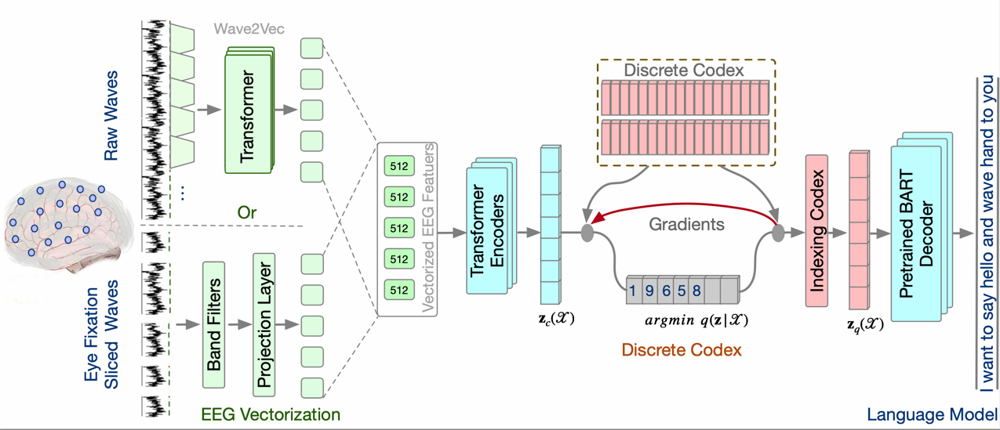

# DeWave: Introducing discrete coding into EEG to text translation

Codes will be update soon.

## Citation
```shell
To be revealed recently
```

This repo is the implementarion of paper xxx which discrete encoding (VQ-VAE) into EEG waves to text translation.
Please refer to our paper for more technology details. The overview of the model structure is illustrated as below.



This repo is based on the [EEG-to-Text](https://github.com/MikeWangWZHL/EEG-To-Text) codes & implementation. 

## Data Preparation

* Download raw data from ZuCo
  * Download ZuCo v1.0 for 'task1-SR','task2-NR','task3-TSR' from https://osf.io/q3zws/files/ under 'OSF Storage' root,
  unzip and move all .mat files to /dataset/ZuCo/task1-SR/Matlab_files,/dataset/ZuCo/task2-NR/Matlab_files,/dataset/ZuCo/task3-TSR/Matlab_files respectively.
  * Download ZuCo v2.0 'Matlab files' for 'task1-NR' from https://osf.io/2urht/files/ under 'OSF Storage' root, unzip and move all .mat files to /dataset/ZuCo/task2-NR-2.0/Matlab_files.
* Preparation scripts for eye fixation sliced data
  * Modify the data paths and roots in [construct_dataset_mat_to_pickle_v1.py](util/construct_dataset_mat_to_pickle_v1.py) and [construct_dataset_mat_to_pickle_v2.py](util/construct_dataset_mat_to_pickle_v2.py)
  * Run [scripts/data_preparation_freq.sh](scripts/data_preparation_freq.sh) for eye-tracking fixation sliced EEG waves. 
* Preparation scripts for raw waves
  * Modify the roots variable in  [scripts/data_preparation_wave.sh](scripts/data_preparation_wave.sh) and run the scripts, -r suggest the source root, -o denotes the output notes
  ```python3 
  ./util/construct_wave_mat_to_pickle_v1.py -t task3-TSR -r /projects/CIBCIGroup/00DataUploading/yiqun/bci -o /projects/CIBCIGroup/00DataUploading/yiqun/bci/ZuCo/dewave_sent
  ```

## Training

### Eye fixation assisted translation
Please refer to [train_codex_freq.py](train_codex_freq.py) and [train_translate_freq.py](train_translate_freq.py) respectively for codex self-supervise initializaiton and translation training. 
Run scripts [scripts/train_codex_ss.sh](scripts/train_codex_ss.sh), [scripts/train_translate_codex.sh](scripts/train_translate_codex.sh) to train the model. 
### Direct translation on raw waves
Please notice that the training for raw waves are extremely memory consuming, try larger GPUs 
Please refer to [train_translate_dewave.py](train_translate_dewave.py) for translation training. The self-supervised initialization will be released soon. 
Run scripts [scripts/train_translate_codex_dewave.sh](scripts/train_translate_codex_dewave.sh) to train the model. 


## Inference

The model is trained and stored in checkpoints folder. 
The evaluation scripts is in [eval_decoding_freq](eval_decoding_freq.py) for eye-tracking fixation and [eval_decoding_dewave](eval_decoding_dewave.py) for raw waves.
After evaluation, the text results could be found in results such as [example](results/task2.0.txt) we uploaded.


## Results

Generated sample:

|              | Sample                                                                                                                                                                                                                                          |
|--------------|-------------------------------------------------------------------------------------------------------------------------------------------------------------------------------------------------------------------------------------------------|
| Ground Truth | Bush attended the University of Texas at Austin, where he graduated Phi Beta Kappa with a Bachelor's degree in Latin American Studies in 1973, taking only two and a half years to complete his work, and obtaining generally excellent grades. |
| Prediction   | was the University of California at Austin in where he studied in Beta Kappa in a degree of degree in history American Studies in 1975. and a one classes a half years to complete the degree. and was a excellent grades.                      |

Due to current training, the model could achieve the best peformance on codex size 2048 and latent size 512. The results are revealed as below. 

 

The subject wise results in task 2.0 on BLEU and ROUGE scores. The text ground truth is the same for each subject, so the metrics difference is not that large. 
For example we visualize the model trained by subjec id "YMD".


| Subject |        YDG        |        YAG        |        YRP        |        YLS        |        YFS        |        YMD        |        YRH        |        YFR        |        YTL        |        YAC        |        YSL        |        YAK        |        YMS        |        YSD        |        YHS        |        YDR        |        YRK        |        YIS        |
|:-------:|:-----------------:|:-----------------:|:-----------------:|:-----------------:|:-----------------:|:-----------------:|:-----------------:|:-----------------:|:-----------------:|:-----------------:|:-----------------:|:-----------------:|:-----------------:|:-----------------:|:-----------------:|:-----------------:|:-----------------:|:-----------------:|
|  BLEU-1 |           44.25   |           44.25   |           44.25   |           44.25   |           44.05   |           44.25   |           44.25   |           43.41   |           44.25   |           44.03   |           44.45   |           44.25   |           44.25   |           44.25   |           44.25   |           44.18   |           44.25   |           44.25   |
|  BLEU-2 |           25.83   |           25.83   |           25.83   |           25.83   |           26.11   |           25.83   |           25.83   |           24.58   |           25.83   |           25.55   |           26.04   |           25.83   |           25.83   |           25.83   |           25.83   |           25.86   |           25.83   |           25.83   |
|  BLEU-3 |           15.18   |           15.18   |           15.18   |           15.18   |           15.38   |           15.18   |           15.18   |           14.40   |           15.18   |           14.86   |           15.32   |           15.18   |           15.18   |           15.18   |           15.18   |           15.28   |           15.18   |           15.18   |
|  BLEU-4 |             8.31  |             8.31  |             8.31  |             8.31  |             8.34  |             8.31  |             8.31  |             7.76  |             8.31  |             7.94  |             8.45  |             8.31  |             8.31  |             8.31  |             8.31  |             8.45  |             8.31  |             8.31  |
| ROUGE-R |           32.18   |           32.18   |           32.18   |           32.18   |           31.84   |           32.18   |           32.18   |           31.27   |           32.18   |           32.02   |           32.32   |           32.18   |           32.18   |           32.18   |           32.18   |           32.23   |           32.18   |           32.18   |
| ROUGE-P |           39.34   |           39.34   |           39.34   |           39.34   |           39.26   |           39.34   |           39.34   |           37.79   |           39.34   |           39.29   |           39.52   |           39.34   |           39.34   |           39.34   |           39.34   |           39.28   |           39.34   |           39.34   |
| ROUGE-F |           35.34   |           35.34   |           35.34   |           35.34   |           35.11   |           35.34   |           35.34   |           34.16   |           35.34   |           35.24   |           35.50   |           35.34   |           35.34   |           35.34   |           35.34   |           35.35   |           35.34   |           35.34   |
